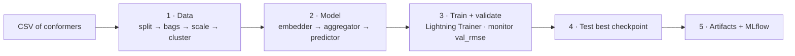
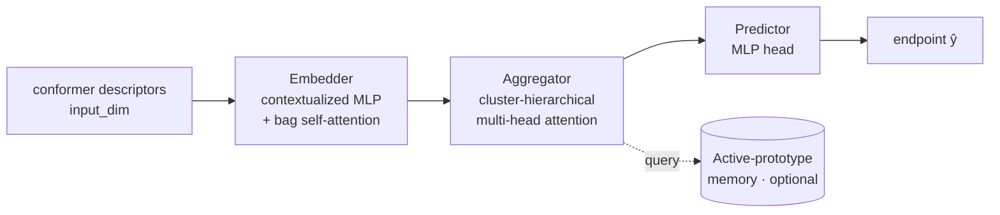

# MILK — Multi-Instance Learning Kit

**MILK** trains multiple-instance-learning (MIL) models on **molecular conformer bags**:
each molecule is a *bag*, its 3D conformers are the *instances*, and the model predicts a
single molecule-level endpoint (e.g. activity/affinity) by learning which conformers matter.

Built on **PyTorch Lightning**, with **MLflow** experiment tracking and a single-command CLI.

- **Task:** regression (or classification) over bags of conformer descriptors.
- **Data:** one CSV where each row is a conformer; rows are grouped into bags by a molecule id.
- **Split:** predefined `split` column — `0 = train`, `1 = val`, `2 = test`. One run: train on
  train, select the best checkpoint on val, evaluate on test.

---

## Concept

```
Molecule (bag)                          Model
────────────────                        ─────────────────────────────
mol_id = "M1"                           per-conformer descriptors
 ├─ conf_id M1_c0  ─ descriptors ─┐
 ├─ conf_id M1_c1  ─ descriptors ─┤──►  embed each conformer
 ├─ conf_id M1_c2  ─ descriptors ─┤──►  attention-pool over conformers ──►  ŷ  (one value per molecule)
 └─ conf_id M1_c3  ─ descriptors ─┘──►  predict
endpoint = 6.7  (label, per molecule)
```

The descriptor columns are fingerprint blocks (e.g. `GETAWAYFingerprint_*`, `WHIMFingerprint_*`,
`USRCATFingerprint_*`, …), auto-detected from the CSV.

---

## Pipeline



**Stages**

1. **Data** (`ppl/data`) — load CSV → apply predefined split → build bags → per-fingerprint-block
   `StandardScaler` (fit on **train only**) → optional per-bag conformer clustering (agglomerative,
   silhouette-selected) → sqrt-block-size normalization. Processed bags are cached under
   the experiment directory.
2. **Model** (`ppl/models`) — assemble `embedder → aggregator → predictor` (see below).
3. **Train/validate** (`ppl/training`) — `Trainer.fit` on train, monitor **`val_rmse`**, keep the
   best checkpoint (with optional attention-refinement schedule).
4. **Test** — evaluate the best checkpoint on the held-out test split.
5. **Artifacts** — prediction CSVs, a `res.txt` summary, attention-weight plots, and MLflow metrics.

### Model architecture



The three components are chosen by name in the config and instantiated directly from a small
catalog (`ppl/models/component_catalog.py`) — no template/registry indirection.

| Slot | Config key | Available (default in **bold**) |
|------|------------|----------------------------------|
| Embedder | `embedder_type` | **contextualized_mlp_embedder_v1**, mlp_embedder_v3 |
| Aggregator | `aggregator_type` | **cluster_hier_mha_v1**, mha_v5, mha_att_v4, vit_aggregator |
| Predictor | `predictor_type` | **mlp_predictor_v3** |

---

## Installation

Requires **Python 3.11 or 3.12** and [Poetry](https://python-poetry.org/).

```bash
# 1. clone
git clone https://github.com/vfastovskii/milkid.git
cd milkid

# 2. fetch the dataset (tracked with Git LFS)
git lfs install
git lfs pull                 # materializes ppl/data/*.csv (~340 MB)

# 3. install dependencies + the `milk` CLI
poetry install
```

> If `git lfs pull` is skipped, `ppl/data/*.csv` remain small pointer files and a run fails with
> `CSV missing required columns`.

Key dependencies (pinned in `pyproject.toml`): `torch`, `lightning`, `torchmetrics`,
`scikit-learn`, `mlflow`, `rdkit`, `optuna`, `pandas`, `matplotlib`.

---

## Quickstart

```bash
# run with the default config (ppl/config/experiment_configs/run_config.yaml)
poetry run milk

# run with a custom config
poetry run milk -c path/to/your_config.yaml

# list available use cases / verbose logging
poetry run milk --list-use-cases
poetry run milk --log-level DEBUG
```

At the default `INFO` level the output is a minimal, staged narrative:

```
Config: run_config.yaml
Experiment: my_experiment
Preparing data…
Data ready: 647 train / 324 val / 0 test bags · 472 features
Model: contextualized_mlp_embedder_v1 → cluster_hier_mha_v1 → mlp_predictor_v3 (13.0M params)
Training up to 100 epochs on mps…
Epoch 0 · train rmse 6.579 mae 6.478 · val rmse 6.761 mae 6.663
Epoch 1 · train rmse 6.155 mae 6.046 · val rmse 6.181 mae 6.075
…
Evaluating best model on the test split…
Test: rmse 0.812 mae 0.640
Results saved to results/my_experiment
Pipeline finished.
```

Use `--log-level DEBUG` to see every technical detail (feature scaling, optimizer groups,
per-block stats, memory, etc.).

---

## Configuration

A run is fully described by one YAML with three sections: `data`, `model`, `trainer`
(see `ppl/config/experiment_configs/run_config.yaml`). Highlights:

### `data`
```yaml
data:
  csv_path: ppl/data/<your>.csv
  task: regression

  # column names
  bag_id_col: mol_id        # groups rows into bags (molecules)
  inst_id_col: conf_id      # instance id (conformer)
  endpoint_value_col: endpoint
  split_col: split          # 0=train, 1=val, 2=test
  series_col: Series        # optional congeneric-series label

  predefined_split: true    # use split_col; if false, stratified split is created
  seed: 42                  # single RNG seed for splits + dataloaders
  batch_size: 16
  balance_train_batches_by_series: true   # each batch covers every series

  cluster_instances: true   # per-bag conformer clustering in scaled space
  cluster_selection_method: silhouette
  cluster_max_clusters: 6
```

### `model`
```yaml
model:
  embedder_type: contextualized_mlp_embedder_v1
  aggregator_type: cluster_hier_mha_v1
  predictor_type: mlp_predictor_v3
  task: regression
  embedder_kwargs:   { ... }   # per-component hyperparameters
  aggregator_kwargs: { ... }
  predictor_kwargs:  { ... }
  active_prototype_kwargs: { enabled: true, ... }   # optional prototype memory
  optim: { lr: 1.0e-4, weight_decay: 3.0e-3, scheduler: plateau, ... }
```

### `trainer`
```yaml
trainer:
  max_epochs: 100
  device: mps                 # "cuda" | "mps" | "cpu"
  precision: "32-true"
  experiment_name: my_experiment
  log_save_dir: my_experiment_log
  checkpoint_monitor: val_rmse
  checkpoint_min_epoch: 30
  attention_refinement_enabled: true   # keep training past overfit with a query ramp
  save_attention_artifacts: true
```

> **Splitting:** with `predefined_split: true` the pipeline reads the `split` column directly.
> With `predefined_split: false` it creates a stratified test split (`test_size`) and, if
> `val_partition: true`, a stratified validation split from the remaining train.

---

## Outputs

For `experiment_name = my_experiment`, results land under `results/my_experiment/`:

```
results/my_experiment/
├── train_fit.csv          # mol_id, true, predicted, abs_error  (train)
├── val.csv                # …                                    (validation)
├── test.csv               # …                                    (test)
├── res.txt                # run summary: val/train metrics, best epoch, schedule
├── train/  validation/  test/
│                          # attention-weight plots, true-vs-predicted figures
└── (best checkpoints under <log_save_dir>/models/cv)
```

Metrics, params, and the model are also logged to **MLflow**. Browse them with:

```bash
mlflow ui --backend-store-uri <log_save_dir>
# then open http://127.0.0.1:5000
```

---

## Package layout

```
ppl/
├── cli/         command-line entry point + logging setup
├── config/      dataclass configs + experiment_configs/*.yaml
├── data/        MILDataModule, bag building, feature scaling, clustering, samplers
├── models/      ModelBuilder + component catalog
│   ├── components/   embedders / aggregators / predictors
│   └── lightning/    LightningModule (training/validation/test steps, optimizers)
├── training/    trainer, callbacks, checkpoints, artifacts, predictions
├── pipeline/    orchestrator, builder, component factory, MLflow utils
├── plotting/    attention-weight and true-vs-predicted plots
├── hpo/         Optuna hyperparameter search
└── utils/       reproducibility helpers
```

The pipeline is a single, one-directional flow (no circular imports) and Lightning owns the
training loop; checkpointing/early-stopping/logging are handled via callbacks.

---

## Notebooks

`notebooks/` mirrors the pipeline step-by-step (they call the same classes as the CLI):

| Notebook | Step |
|----------|------|
| `00_overview_and_config.ipynb` | Load & inspect the config |
| `01_data_preprocessing.ipynb` | `MILDataModule.setup()` — bags, clustering, scaling |
| `02_model_construction.ipynb` | Build the MIL model |
| `03_model_training.ipynb` | Train → validate → test |

Select the Poetry environment as the Jupyter kernel and run `git lfs pull` first.

---

## Hyperparameter optimization (optional)

Optuna-based search + final retrain lives in `ppl/hpo`:

```bash
poetry run python -m ppl.hpo.optuna_final_pipeline \
  --base-config ppl/config/experiment_configs/run_config.yaml \
  --search-space ppl/config/experiment_configs/<search_space>.yaml \
  --n-trials 40 --metric val_rmse
```

A SLURM launcher is provided at `ppl/scripts/run_optuna_final_milk.slurm`.
