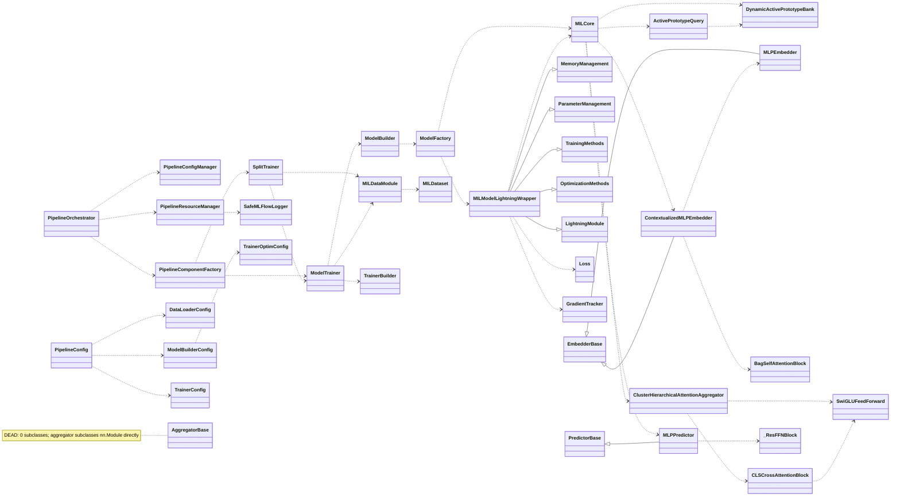

# MILK Architecture Audit

Class-based architecture map of `ppl/`. Read-only inventory produced by parallel
exploration. **48 classes** across 9 packages.

> Phase status: **Phase 1 (MAP) complete.** Phase 2 (AUDIT) pending approval.

---

## (a) Class list

LOC and public-method counts are approximate (from source). `→` in *Inheritance*
shows the direct base. *Deps* = other **project** classes imported / instantiated /
subclassed (stdlib / torch / lightning bases omitted). Structural notes in the last
column are factual observations that feed Phase 2 (not yet ranked).

### `ppl/config` + `ppl/cli`

| Class | File:line | LOC | Public iface | Inherits | Deps | Note |
|---|---|--:|---|---|---|---|
| DataLoaderConfig | config/data_loader_config.py:8 | 44 | ~30 attrs, 0 methods | dataclass | — | pure data |
| TrainerConfig | config/trainer_config.py:12 | 70 | ~50 attrs, 0 methods | dataclass | — | pure data |
| TrainerOptimConfig | config/trainer_optim_config.py:6 | 27 | ~18 attrs, 0 methods | dataclass | — | pure data |
| ModelBuilderConfig | config/model_builder_config.py:9 | 47 | `update()` | dataclass | TrainerOptimConfig | pure data + 1 fn |
| PipelineConfig | config/pipeline_config.py:17 | 133 | `from_yaml()` | dataclass | DataLoaderConfig, ModelBuilderConfig, TrainerConfig, TrainerOptimConfig | aggregates 3 configs |
| TrainerBuilder | config/trainer_config.py:83 | 83 | `build()` (static) | object | TrainerConfig | 1 static method → could be a function |
| _CleanFormatter | cli/pipeline_setup_utils.py:83 | 7 | `format()` | logging.Formatter | — | stdlib subclass |
| _NarrativeFilter | cli/pipeline_setup_utils.py:92 | 8 | `filter()` | logging.Filter | — | stdlib subclass |

### `ppl/pipeline`

| Class | File:line | LOC | Public iface | Inherits | Deps | Note |
|---|---|--:|---|---|---|---|
| PipelineOrchestrator | pipeline/orchestrator.py:28 | 114 | `run()`, ctx-mgr | object | PipelineConfig (+ delegates to initialize/execute helpers) | thin coordinator |
| PipelineConfigManager | pipeline/config_manager.py:26 | 146 | `validate_config`, `configure_{data,model,trainer,reproducibility}` | object | all 5 configs + utils | 5 configure_* methods |
| PipelineComponentFactory | pipeline/component_factory.py:22 | 159 | `create_ppl_components()` | object | instantiates ModelTrainer, SplitTrainer | factory, 1 product-pair |
| PipelineResourceManager | pipeline/resource_manager.py:20 | 102 | `cleanup_resources()`, ctx-mgr | object | create_mlflow_logger → SafeMLFlowLogger | wraps 1 logger |
| SafeMLFlowLogger | pipeline/mlflow_utils.py:18 | 10 | (overrides 1 method) | MLFlowLogger | — | upstream bugfix subclass |
| TimeoutError | pipeline/builder.py:27 | 3 | — | Exception | — | bare exception |

### `ppl/data`

| Class | File:line | LOC | Public iface | Inherits | Deps | Note |
|---|---|--:|---|---|---|---|
| MILDataModule | data/data_loader.py:75 | 197 | `setup`, `*_dataloader` (×4), `val_bag_ids`, `apply_train_instance_selection` | pl.LightningDataModule | MILDataset; delegates to `data_module_impl`/`data_loader_impl` free fns | **facade** over free functions |
| MILDataset | data/dataset.py:14 | 249 | `__len__`, `__getitem__`, `apply_instance_selection` | torch Dataset | — | real logic |
| SeriesBalancedBatchSampler | data/samplers.py:11 | 151 | `__len__`, `__iter__` | BatchSampler | — | real logic |

### `ppl/training` + `ppl/hpo`

| Class | File:line | LOC | Public iface | Inherits | Deps | Note |
|---|---|--:|---|---|---|---|
| ModelTrainer | training/model_trainer.py:30 | 424 | `build_model`, `callbacks`, `create_trainer`, `log_hyperparams`, `get_best_model`, `fit_validate` | object | ModelBuilder, TrainerBuilder, MILDataModule, SafeMLFlowLogger, (+artifact/ablation fns) | **>300 LOC** |
| SplitTrainer | training/split_trainer.py:24 | 180 | `run()` | object | ModelTrainer, MILDataModule | thin orchestrator |
| EpochAttentionWeightLogger | training/epoch_attention_weight_logger.py:18 | 630 | `on_{train,validation}_epoch_end` | pl.Callback | — | **>300 LOC** |
| EpochEmbeddingLogger | training/epoch_embedding_logger.py:15 | 532 | `on_validation_epoch_end` | pl.Callback | — | **>300 LOC** |
| MinEpochModelCheckpoint | training/checkpoints.py:8 | 28 | (overrides 1) | ModelCheckpoint | — | small subclass |
| InstanceImportanceResult | training/post_training_ablation.py:20 | 9 | 5 attrs | dataclass | — | pure data |
| MilkOptunaObjective | hpo/optuna_runner.py:355 | 213 | `__call__` | object (callable) | — (subprocess to CLI) | callable object |

### `ppl/models` (core, lightning, misc)

| Class | File:line | LOC | Public iface | Inherits | Deps | Note |
|---|---|--:|---|---|---|---|
| MILCore | models/core.py:19 | ~1007 | `forward()` | nn.Module | DynamicActivePrototypeBank, ActivePrototypeQuery | **>300 LOC**; ~30 active-proto attrs |
| MILModelLightningWrapper | models/lightning/base.py:25 | 123 | `__init__` (rest inherited) | **MemoryManagement, ParameterManagement, TrainingMethods, OptimizationMethods, pl.LightningModule** | MILCore, Loss, GradientTracker | **4-mixin multi-inheritance** |
| TrainingMethods | models/lightning/training.py:10 | ~1258 | 10 Lightning hooks (+~25 private) | nn.Module | duck-typed `self.core`/`self.criterion` | **mixin, >300 LOC** |
| OptimizationMethods | models/lightning/optimization.py:11 | 272 | `configure_optimizers` | nn.Module | TrainerOptimConfig | mixin |
| MemoryManagement | models/lightning/memory_management.py:12 | 77 | **0 public** (2 private) | nn.Module | — | mixin, no public API |
| ParameterManagement | models/lightning/parameter_utils.py:8 | 46 | **0 public** (1 private) | nn.Module | — | mixin, no public API |
| Loss | models/loss.py:9 | 47 | `forward` | nn.Module | — | small |
| GradientTracker | models/gradient_tracking.py:19 | 261 | `reset_stats`, `remove_hooks`, `log_stats_to_mlflow` | object | — | hook manager |
| ModelBuilder | models/model_builder.py:15 | 70 | `build()` | object | ModelFactory, ModelBuilderConfig | **one-deep delegate → ModelFactory** |
| ModelFactory | models/model_factory.py:14 | 82 | `build_model` (static), `validate_model_architecture` (static) | object | MILCore, MILModelLightningWrapper, build_components | stateless static holder |
| DynamicActivePrototypeBank | models/active_prototype_memory.py:12 | ~440 | 11 (`update`, `merge_close_prototypes`, `prune_weak_prototypes`, `get_active_prototypes`, `num_active`, …) | nn.Module | — | **>300 LOC** |
| ActivePrototypeQuery | models/active_prototype_memory.py:459 | ~160 | `forward`, `masked_mean` (static) | nn.Module | DynamicActivePrototypeBank (param) | — |

### `ppl/models/components`

| Class | File:line | Public iface | Inherits | Deps | Note |
|---|---|---|---|---|---|
| EmbedderBase | .../embedders/base_embedder.py:4 | `forward` → NotImplementedError | nn.Module | — | **empty marker** (2 subclasses) |
| MLPEmbedder | .../embedders/mlp_embedder.py:100 | `forward`, `reset_parameters`, `describe` | EmbedderBase | DropPath(emb) | — |
| DropPath (emb) | .../embedders/mlp_embedder.py:41 | `forward` | nn.Module | — | **duplicate of predictors' DropPath** |
| ContextualizedMLPEmbedder | .../embedders/contextualized_mlp_embedder.py:168 | `forward`, `describe` | EmbedderBase | MLPEmbedder, BagSelfAttentionBlock, DropPath(emb) | — |
| BagSelfAttentionBlock | .../embedders/contextualized_mlp_embedder.py:26 | `forward`, `describe` | nn.Module | DropPath(emb) | — |
| AggregatorBase | .../aggregators/base_aggregator.py:4 | `forward` → NotImplementedError | nn.Module | — | **DEAD: 0 subclasses, unused** |
| ClusterHierarchicalAttentionAggregator | .../aggregators/cluster_hierarchical_attention.py:141 | `forward` (+ many private) | nn.Module *(not AggregatorBase)* | CLSCrossAttentionBlock, SwiGLUFeedForward | ignores its own base |
| SwiGLUFeedForward | .../aggregators/cluster_hierarchical_attention.py:41 | `forward` | nn.Module | — | — |
| CLSCrossAttentionBlock | .../aggregators/cluster_hierarchical_attention.py:68 | `forward` | nn.Module | SwiGLUFeedForward | — |
| PredictorBase | .../predictors/base_predictor.py:3 | `forward` → NotImplementedError | nn.Module | — | **empty marker** (1 subclass) |
| MLPPredictor | .../predictors/mlp_predictor.py:157 | `forward`, `forward_features`, `describe` | PredictorBase | _ResFFNBlock | — |
| _ResFFNBlock | .../predictors/mlp_predictor.py:28 | `forward` | nn.Module | DropPath(pred) | — |
| DropPath (pred) | .../predictors/mlp_predictor.py:10 | `forward` | nn.Module | — | **duplicate of embedders' DropPath** |

---

## (b) Class map

Two edge kinds: **`--|>` inheritance**, **`..>` builds/uses (instantiation or composition)**.
Trivial `nn.Module`/dataclass bases and config-import edges are omitted to keep the map legible;
the table above is the exhaustive record.

### Standalone / low-edge classes (in table, off the map)
`SeriesBalancedBatchSampler`, `MinEpochModelCheckpoint`, `EpochAttentionWeightLogger`,
`EpochEmbeddingLogger`, `InstanceImportanceResult`, `MilkOptunaObjective`,
`_CleanFormatter`, `_NarrativeFilter`, `TimeoutError`, `DropPath×2`, `SwiGLUFeedForward`.

---

## Structural facts carried into Phase 2 (not yet ranked)

1. **4-mixin `nn.Module` inheritance** into `MILModelLightningWrapper`; mixins used only for code reuse (referenced nowhere but `base.py`). `TrainingMethods` = 1,258 LOC; `MemoryManagement`/`ParameterManagement` expose **0 public methods**.
2. **`AggregatorBase` dead** (0 subclasses; the aggregator subclasses `nn.Module`). `EmbedderBase`/`PredictorBase` are empty `NotImplementedError` markers.
3. **`ModelBuilder → ModelFactory`** one-deep delegation (factory for a single product).
4. **`MILDataModule`** is a facade over free functions in `data_module_impl`/`data_loader_impl`.
5. **`DropPath` duplicated** (embedders + predictors), functionally identical.
6. **>300-LOC classes:** `TrainingMethods` (1258), `MILCore` (1007), `EpochAttentionWeightLogger` (630), `EpochEmbeddingLogger` (532), `DynamicActivePrototypeBank` (~440), `ModelTrainer` (424).
7. `TrainerBuilder`, `ModelFactory` are stateless static-method holders (function-shaped).

---

# Phase 2 — Audit

Findings scored against SOLID · composition-over-inheritance · coupling/cohesion ·
dead-weight. **Severity** = maintainability/correctness risk. **Effort** = size of the
change. Ranked by **impact-to-effort** (do the top rows first). Every proposed fix is a
*deletion or collapse* — no new abstractions (per the stated constraints).

## Ranked findings

| # | Finding | file:line | Sev | Effort | I/E | Fix (deletes code) |
|--:|---|---|:--:|:--:|:--:|---|
| 1 | **`AggregatorBase` is dead** — 0 subclasses; the aggregator subclasses `nn.Module` and never references it (only re-exported in `__init__`). A base class that lies about the hierarchy. | components/aggregators/base_aggregator.py:4 | med | trivial | ★★★★★ | Delete the class + its export. |
| 2 | **`ModelBuilder` → `ModelFactory` is a factory guarding a factory.** `build()` = input_dim null-check + `ModelFactory.build_model(...)`. `ModelFactory` is a stateless holder of 2 static methods. Two classes, one product, one-deep delegation. | model_builder.py:42, model_factory.py:14 | med | small | ★★★★★ | Collapse into one module fn `build_model(cfg, input_dim, task)`; move the null-check + validate into it. Deletes 2 classes. |
| 3 | **`TimeoutError(Exception)` shadows the builtin.** Name collision; confusing at every `except TimeoutError`. | pipeline/builder.py:27 | low | trivial | ★★★★★ | Delete and use the builtin, or rename `PipelineTimeout`. |
| 4 | **`MemoryManagement` & `ParameterManagement` are `nn.Module` mixins with 0 public methods** — each holds 1–2 private helpers (`_log_memory_usage`, `_split_params_for_weight_decay`) that operate on the wrapper's `self`. Inheritance used purely to smuggle 3 helpers into `MILModelLightningWrapper`; adds two `nn.Module` bases to a 5-deep MRO. | lightning/memory_management.py:12, lightning/parameter_utils.py:8 | med | small | ★★★★☆ | Make them module-level functions taking `module`/`core`; call from the wrapper. Deletes 2 classes + 2 MRO bases (composition over inheritance). |
| 5 | **Duplicated export/plot logic.** `SplitTrainer._export_plots` and `artifacts.export_fit_artifacts`/`evaluate_on_test` both call `get_best_model()` and the same `plot_attention_weights_from_model`/`plot_true_vs_pred_from_model` paths. | split_trainer.py:124, artifacts.py:37/181 | med | med | ★★★☆☆ | Route both through one `artifacts.export_plots(model, dm, dirs)` helper. |
| 6 | **`GradientTracker` feature envy + dead by default.** Reaches `self.model.embedder.layers[0]`, `self.model.aggregator.mha.out_proj.weight` (Demeter break, brittle `hasattr` ladder). 261 LOC, gated off by `enable_gradient_tracking: false`. | gradient_tracking.py:65–107 | med | small | ★★★☆☆ | Delete the class + the disabled hook path (verify no one flips the flag). Biggest LOC deletion for the effort. |
| 7 | **`EmbedderBase` / `PredictorBase` are empty markers.** No `abc`, no shared logic — just `forward → raise NotImplementedError`. 2 and 1 concrete subclasses. Speculative abstraction now the catalog holds one of each. | embedders/base_embedder.py:4, predictors/base_predictor.py:3 | low | small | ★★★☆☆ | Delete; have impls subclass `nn.Module` directly. (Optional — they cost ~5 LOC each.) |
| 8 | **`TrainerBuilder` is a one-static-method class.** No state; `build()` could be a function. | config/trainer_config.py:83 | low | trivial | ★★★☆☆ | Demote to `build_trainer(config, ...)` function in the same module. |
| 9 | **`ModelTrainer` mixes build + train + checkpoint + validate + artifact export** (424 LOC, 6 public). Borderline SRP; the artifact/plot orchestration is a separable concern (see #5). | model_trainer.py:30 | med | med | ★★☆☆☆ | Move artifact/eval export out (folds into #5); don't otherwise split — the build/fit methods are cohesive. |
| 10 | **`DropPath` duplicated** (functionally identical, cosmetic diffs). | embedders/mlp_embedder.py:41, predictors/mlp_predictor.py:10 | low | small | ★★☆☆☆ | *Leave it* unless a shared `layers.py` is wanted — deduping couples predictor→embedder or adds a file (tradeoff ≈ the 15 LOC saved). |
| 11 | **`TrainingMethods` god-mixin, 1,258 LOC**, 10 Lightning hooks + ~25 private (loss accumulation + overfit-gap scheduler + attention-refinement state machine + active-proto status). Single largest SRP violation. | lightning/training.py:10 | high | high | ★☆☆☆☆ | *Defer.* Behavior-critical; splitting = large risky diff. If touched, extract the attention-refinement/overfit-gap **schedules** into a plain helper object (they're self-contained state machines). |
| 12 | **`MILCore` 1,007 LOC** — forward pipeline + ~30 active-prototype config attrs + ~15 active-proto orchestration helpers. | core.py:19 | high | high | ★☆☆☆☆ | *Defer.* The active-prototype gating/update logic is a cohesive collaborator that could move to a helper, but the diff is large and behavior-sensitive. |

★ rating = impact ÷ effort (5 = biggest win per unit work). Rows 1–4 are near-free deletions; 11–12 are the real god classes but high-risk.

## By category (detail)

**SOLID — SRP.** God classes by size: `TrainingMethods` (1258, #11), `MILCore` (1007, #12), `ModelTrainer` (424, #9). The two epoch loggers (630/532) are long but *cohesive* (each dumps one artifact) — long ≠ god; not flagged. **OCP/DIP:** `ModelTrainer` depends on concrete `ModelBuilder`/`TrainerBuilder` — **do not invert**; one implementation each, so an interface would *add* code for zero benefit (violates the "no pattern unless it removes code" constraint). No **Liskov** violations found (empty bases have exactly one contract, `forward`, and subclasses honor it). No **fat interfaces** beyond the god classes above.

**Composition over inheritance.** The `MILModelLightningWrapper` 4-mixin stack (#4 covers the two worthless ones). `TrainingMethods`/`OptimizationMethods` at least carry the Lightning hooks / optimizer config as a genuine (if large) split; the wrapper's MRO is `Memory → Parameter → Training → Optimization → LightningModule` — **5 `nn.Module` bases**, held together by cooperative `super().__init__()`. Fragile, but flattening all four into one 1,600-LOC file is worse; #4 removes the two that carry no interface. Inheritance depth elsewhere is ≤2 (`MLPPredictor → PredictorBase → nn.Module`) — fine.

**Coupling & cohesion.** Feature envy: `GradientTracker` (#6). Circular deps: **none currently** — the full import chain imports clean; note `ppl/pipeline/__init__.py` is deliberately empty to keep it that way (a latent cycle was removed earlier), so keep re-export hubs out of `__init__`. Data-bag+manipulator: the config dataclasses are edited by `override_dataclass`/`PipelineConfigManager` — **acceptable**: configs are meant to be data, and the manipulator is generic, not per-class.

**Dead weight.** `AggregatorBase` (#1), `ModelBuilder`/`ModelFactory` split (#2), `TimeoutError` shadow (#3), the two 0-public mixins (#4), `GradientTracker` (#6), empty embedder/predictor bases (#7), `TrainerBuilder` class (#8). Together ≈ **6–8 class definitions removable** with small, behavior-preserving diffs.

## Explicitly NOT violations (leave alone — refactoring these adds code)

- **`MILDataModule` facade** — Lightning *requires* a `LightningDataModule` subclass with `setup`/`*_dataloader` hooks. Delegating their bodies to free functions in `data_module_impl` is fine; the class earns its existence via the framework contract.
- **`SafeMLFlowLogger`** — subclass that patches a real upstream `MLFlowLogger` bug (#15111). Legit; not a gratuitous stdlib wrapper.
- **Config dataclasses** (`DataLoaderConfig`, `TrainerConfig`, …) as "data bags" — dataclasses are the correct tool for typed config; no behavior belongs on them.
- **`InstanceImportanceResult`**, `MinEpochModelCheckpoint`, `SeriesBalancedBatchSampler` — right-sized (dataclass / small framework subclass / real algorithm).
- **Concrete deps in the pipeline managers** — single-implementation collaborators; DI/interfaces here would be speculative.

## Suggested Phase 3 batch (all deletions, behavior-preserving)

Rows **1, 2, 3, 4** first (near-free, ~6 classes gone), then **5+6** (dedupe export + delete disabled tracker). Rows 7, 8, 10 are optional polish. Rows 11–12 (the god classes) only if you explicitly want to spend the risk budget — I'd leave them.

---

# Phase 3 — Refactor Plan (full list)

Each finding: **Action** (merge/split/delete/flatten) · **Files** · **Diff** (net LOC; − = deleted) ·
**Risk** · **Test** (characterization test written first if the class has none). Execution is
one-at-a-time in Phase 4, commit-per-finding, behavior identical.

### Batch A — deletions & collapses (behavior-preserving, low risk)

**A1 · Delete `AggregatorBase`** *(delete)*
Files: `components/aggregators/base_aggregator.py` (delete), `components/aggregators/__init__.py` (drop export). Nothing subclasses or `isinstance`-checks it.
Diff: **−9 LOC**, 2 files. Risk: none. Test: import + `build_model` smoke.

**A2 · Collapse `ModelBuilder` + `ModelFactory` → one `build_model()` function** *(merge/flatten)*
`ModelBuilder(cfg).build()` = null-check + `ModelFactory.build_model(...)`; `ModelFactory` = 2 static methods. Make `model_factory.py` expose module functions `build_model(cfg, input_dim, task)` (inlining the input_dim guard) and `validate_model_architecture(...)`; delete `model_builder.py`.
Callers: `model_trainer.py:100` (`ModelBuilder(model_cfg).build()` → `build_model(model_cfg, model_cfg.input_dim, task)`), `models/__init__.py:6` export.
Diff: **−70 LOC**, deletes 2 classes, touches 3 files. Risk: low. Test: existing `build_model` smoke (from the session) + assert same param count.

**A3 · Remove `TimeoutError` builtin shadow** *(delete)*
`pipeline/builder.py:27`. Grep its raise/except sites first; if the `signal.alarm` path raises the builtin anyway, the custom class is dead → delete; else rename `PipelineTimeout`.
Diff: **−3 LOC** (or rename). Risk: none. Test: import.

**A4 · Demote `MemoryManagement` + `ParameterManagement` mixins → module functions** *(flatten inheritance → composition)*
Three helpers, all operate on the wrapper's `self`: `_log_memory_usage` (4 call sites: base.py:66, optimization.py:28, training.py:862/866), `_log_model_size` (base.py:123), `_split_params_for_weight_decay` (5 sites in optimization.py). Move to plain functions `log_memory_usage(tag, level)`, `log_model_size(module)`, `split_params_for_weight_decay(module)` in `lightning/_module_utils.py`; drop the two classes from `MILModelLightningWrapper`'s bases (5 → 3).
Diff: **−25 LOC** (class boilerplate + 2 files → 1), deletes 2 classes + 2 MRO bases. Risk: low-med — **verify** `_log_memory_usage` holds no `self` peak-state (if it does, keep a module-level counter) and that the 3-base `nn.Module` MRO still `__init__`s cleanly. Test: model init + one `training_step`.

**A5 · `TrainerBuilder` → `build_trainer()` function** *(flatten)*
One static method, no state. `config/trainer_config.py:83`; caller `model_trainer.py` (via `TrainerBuilder.build`).
Diff: **−10 LOC**. Risk: none. Test: trainer builds.

**A6 · Delete `EmbedderBase` / `PredictorBase` empty markers** *(delete — optional)*
No `abc`, no shared logic. Impls (`MLPEmbedder`, `ContextualizedMLPEmbedder`, `MLPPredictor`) subclass `nn.Module` directly; drop the base imports/exports. Grep for `isinstance(..., EmbedderBase/PredictorBase)` first (expect none).
Diff: **−20 LOC**, 3 files. Risk: low. Test: `build_model` smoke. *(Keep if you value them as interface docs — they cost ~5 LOC each.)*

**A7 · Dedupe `DropPath`** *(merge — optional, has a tradeoff)*
Two identical copies. Options: (i) leave it — 15 LOC × 2, zero coupling; (ii) one `components/_layers.py`, import in both. (ii) adds a file to save 15 LOC → marginal.
Diff: **−15 LOC, +1 file**. Risk: low. **Recommend: skip** unless you want the single source.

### Batch B — dedupe + feature-flag removal (medium risk)

**B1 · Dedupe export/plot logic** *(merge)* — covers findings #5 and #9
`SplitTrainer._export_plots` (split_trainer.py:124) and `artifacts.export_fit_artifacts`/`evaluate_on_test` (artifacts.py:37/181) both `get_best_model()` + call the same `plot_attention_weights_from_model` / `plot_true_vs_pred_from_model`. Extract one `artifacts.export_split_plots(model, dm, results_dir, task)` and call from both. This also trims `ModelTrainer` (#9) by moving its artifact orchestration out.
Diff: **−60 LOC** across split_trainer/artifacts/model_trainer. Risk: med (touches the fragile true-vs-pred/`__noexp` path — regression-check the plot filter still fires). Test: run export on a 1-epoch model, assert `val.csv` + `*_top20.csv` written and `__noexp`-filtered.

**B2 · Delete `GradientTracker`** *(delete — FEATURE REMOVAL)*
261-LOC class with deep feature envy into `MILCore` internals (`model.embedder.layers[...]`, `model.aggregator.mha.out_proj`). **Default-on** (`trainer_optim_config.py:31 = True`) but disabled in every shipped config (run_config + HPO). Delete `gradient_tracking.py`, the instantiation (base.py:119-120), the usage (training.py:1182-1233), and the `enable_gradient_tracking` field.
Diff: **−290 LOC**, deletes 1 class, touches 4 files. Risk: med — it's a defaulted-on debug feature, so this **removes a capability**, not just dead code. Test: model init + train step with the tracker gone. **Your call: delete, or keep and just flip the default to `False`?**

### Batch C — god-class splits (high risk, code-motion not deletion, needs tests first)

> These make each file *easier to explain*, not smaller overall (LOC ≈ moved). Both touch the
> hot path and have **no existing tests** → Phase 4 writes a characterization test *before* touching.

**C1 · Split `TrainingMethods` (1,258 LOC) → extract `TrainingCurriculum`** *(split)*
The cohesive cluster is the attention-refinement + overfit-gap **state machine** (training.py:164–517: `_attention_refinement_query_weight`, `_attention_refinement_phase`, `_apply_attention_refinement_phase`, `_maybe_update_attention_refinement_schedule`, `_mark_attention_refinement_complete`, `_maybe_stop_for_overfit_gap`, `_set_core_active_query_override`, …). Move to a plain helper object the wrapper holds (`self._curriculum`); it takes `(core, trainer, current_epoch, val_metrics)` and returns actions. `training.py` drops to ~900 LOC; the curriculum becomes a ~350-LOC self-contained unit.
Diff: **~350 LOC moved**, net ≈ 0, +1 file. Risk: **high** (per-epoch schedule drives LR + query weight + early stop). Test: **characterization first** — run K epochs on a fixed seed, snapshot per-epoch (train/val loss, refinement trigger epoch, forced query weight, `should_stop`); assert byte-identical before/after.

**C2 · Split `MILCore` (1,007 LOC) → extract `ActivePrototypeController`** *(split)*
The active-prototype cluster (core.py:137–712: `_configure_active_prototypes`, `_should_update_active_prototypes`, `_should_use_active_query`, `_effective_active_query_weight`, `_update_active_prototypes_from_batch`, `_select_ablation_refined_active_candidates`, `_add_active_prototype_extras`, `_log_active_prototype_forward_status`, … ~12 methods + ~30 config attrs) is a bounded collaborator around the bank + query builder. Move to `ActivePrototypeController` holding `bank`, `query_builder`, config; `MILCore.forward` calls `self.active_proto.maybe_update(...)` / `.maybe_query(...)`. `core.py` drops to ~500 LOC.
Diff: **~500 LOC moved**, net ≈ 0, +1 file. Risk: **high** (forward path; the epoch-8 query-engagement logic lives here). Test: **characterization first** — forward on a fixed batch/epoch, assert identical `logit`, `extras`, and bank buffers (`prototypes`, `counts`, `active_mask`) before/after.

## Totals

| Batch | Classes removed | Net LOC | Risk |
|---|--:|--:|---|
| A (A1–A6) | ~7 | **−160** | low |
| B (B1–B2) | 1 | **−350** | med |
| C (C1–C2) | 0 (2 added, 2 shrunk) | ≈ 0 (≈850 moved) | high |

**Recommended order:** A1→A2→A3→A5→A4→A6, then B1, then B2 (decide delete vs default-off), then — only if you want the risk — C1, C2. Each is its own commit; tests run after each; C-batch gets a characterization test first.

**Awaiting your pick of which rows to execute in Phase 4.**
