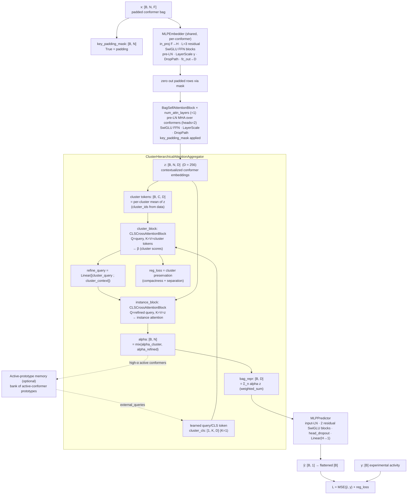
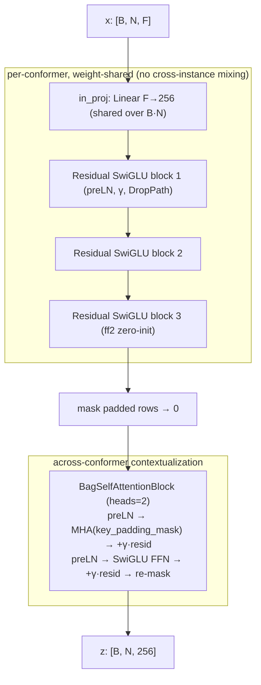
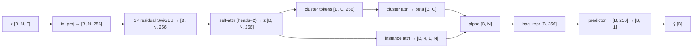
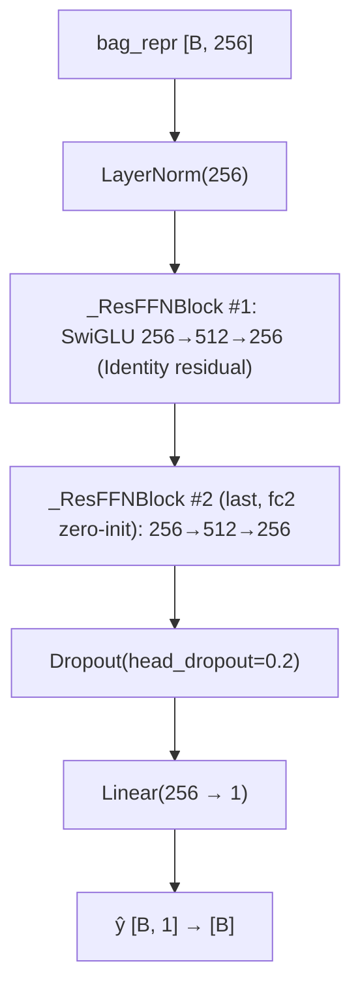
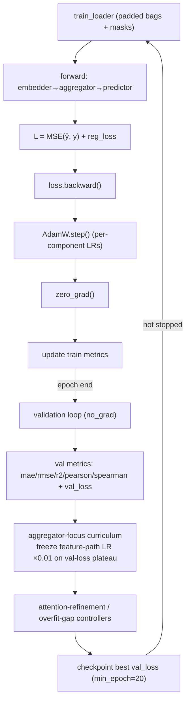
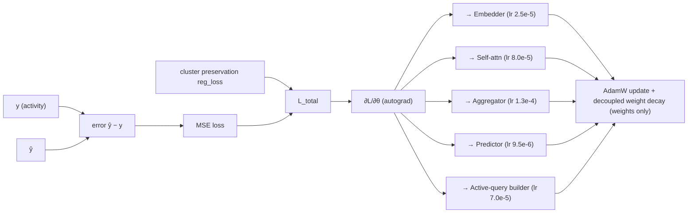

# Detailed Technical Explanation of the MIL Pipeline

> **Scope.** This document describes the multiple-instance-learning (MIL) pipeline implemented in the `ppl/` package of this repository, as configured by `ppl/config/experiment_configs/run_config.yaml`. It traces the model layer by layer and tensor by tensor, from the raw conformer descriptor bag `x: [B, N, F]` to the scalar molecular activity prediction `ŷ: [B, 1]`, and documents the objective, optimizer, scheduler, trainer loop, metrics, and interpretability machinery.
>
> All hyperparameter values quoted are the exact values found in the code and in `run_config.yaml`. Where the code does not pin a value, that is stated explicitly with a `Not specified …` note. Comments in the config that reference "paper" values (a different, published configuration) are reproduced where relevant but the **active** value is the one used.

**Component classes (exact names from code):**

| Role | Class | File |
|---|---|---|
| Contextualized embedder | `ContextualizedMLPEmbedder` (wraps `MLPEmbedder` + `BagSelfAttentionBlock`) | `ppl/models/components/embedders/contextualized_mlp_embedder.py` |
| Aggregator | `ClusterHierarchicalAttentionAggregator` (uses `CLSCrossAttentionBlock`, `SwiGLUFeedForward`) | `ppl/models/components/aggregators/cluster_hierarchical_attention.py` |
| Predictor | `MLPPredictor` (uses `_ResFFNBlock`) | `ppl/models/components/predictors/mlp_predictor.py` |
| Core network | `MILCore` | `ppl/models/core.py` |
| Lightning wrapper | `MILModelLightningWrapper` | `ppl/models/lightning/base.py` |
| Loss | `SupervisedLoss` (aliased `AdaptiveEntropicLoss`) | `ppl/models/adaptive_entropic_loss.py` |
| Key-instance memory | `DynamicActivePrototypeBank`, `ActivePrototypeQuery` | `ppl/models/active_prototype_memory.py` |

---

## 1. Executive summary

The pipeline is a **permutation-invariant multiple-instance regression model** for conformer ensembles. Each molecule is represented as a *bag* of `N` conformers, and each conformer is described by an `F`-dimensional precomputed 3D-fingerprint descriptor vector. The model predicts a single molecule-level scalar activity (a log-scale endpoint such as pIC50/pKi; in the BACE dataset shipped here the target column is `endpoint`).

The forward chain is:

```text
x [B, N, F] → contextualized embedder → z [B, N, D] → cross-attention aggregator → bag_repr [B, D] → predictor → ŷ [B, 1]
```

Module-by-module:

- **Contextualized embedder (`ContextualizedMLPEmbedder`).** A shared, per-conformer transformer-style residual MLP (`MLPEmbedder`, SwiGLU-gated, pre-LayerNorm, LayerScale, stochastic depth) maps each conformer descriptor `x[b,n,:] ∈ ℝ^F` independently to a latent vector in `ℝ^D`. Then one or more `BagSelfAttentionBlock`s apply masked multi-head self-attention **across the conformers of the same bag**, letting conformers exchange information. No positional embeddings are used, so the block is permutation-equivariant. Output: `z: [B, N, D]`.
- **Hierarchical cross-attention aggregator (`ClusterHierarchicalAttentionAggregator`).** Conformers are first summarized into per-cluster tokens (cluster assignments come precomputed from the data loader). A learned query (CLS) token cross-attends over the **cluster tokens** to score clusters, then a refined query cross-attends over the **individual conformers** to produce a final per-conformer attention distribution `alpha: [B, N]`. The bag representation `bag_repr: [B, D]` is the `alpha`-weighted sum of conformer features. This two-stage design implements coarse-to-fine key-instance selection.
- **Predictor head (`MLPPredictor`).** A residual SwiGLU MLP maps `bag_repr ∈ ℝ^D` to the scalar `ŷ`.
- **Training.** The supervised objective is mean-squared error between `ŷ` and the experimental activity, plus a small cluster-structure regularizer emitted by the aggregator. Optimization is AdamW with per-component learning rates, decoupled weight decay (biases/norms excluded), and **no plain LR scheduler** (`scheduler: none`) — an aggregator-focus curriculum manages the learning rate instead. Training is orchestrated with PyTorch Lightning and includes checkpointing on best `val_loss`, an "attention-refinement" post-overfit phase (freeze the feature path + ramp in the prototype query), and an optional overfit-gap early stop.

A secondary, optional subsystem — the **active-prototype memory** — accumulates embeddings of high-attention conformers from *active* molecules during training and injects them back as external queries into the aggregator. This supports **bioactive key-conformer identification** and can be analyzed post hoc.

---

## 2. End-to-end architecture scheme



The active-prototype path (dashed) is enabled in the shipped config (`active_prototype_kwargs.enabled: true`) but only engages after a warm-up and when enough prototypes exist. It conditions the learned query rather than replacing it.

---

## 3. Tensor shape map

`B` = bags (molecules) in a batch (`batch_size: 13`). `N` = `N_max`, the padded conformer count for the batch (variable; the raw dataset uses up to ~200 conformers per molecule after pruning). `F` = input descriptor width (injected at runtime, see §4.2). `D` = embedding width = `256`. `C` = number of conformer clusters in a bag (≤ `cluster_max_clusters: 6`). `K` = number of query tokens = `1`. `H_heads` = attention heads.

| Stage | Tensor name | Shape | Meaning | Notes |
|---|---|---|---|---|
| Input | `x` (`bags`) | `[B, N, F]` | Padded bag of conformer descriptors | `collate_mil` zero-pads to `N_max` |
| Input | `key_padding_mask` | `[B, N]` (bool) | `True` = padding, `False` = real conformer | PyTorch convention |
| Input | `cluster_ids` | `[B, N]` (long) | Per-conformer cluster label; `-1` for padding | From agglomerative clustering |
| Input | `y` | `[B]` | Experimental activity target | `float`, flattened |
| Local embed | `h = MLPEmbedder(x)` | `[B, N, D]` | Per-conformer latent (pre-context) | Padded rows zeroed by mask |
| Context | `z` | `[B, N, D]` | Contextualized conformer embeddings | Self-attention output |
| Cluster tokens | `cluster_tokens` | `[B, C, D]` | Mean-pooled per-cluster summaries | `_make_cluster_tokens` |
| Cluster scores | `cluster_attn` | `[B, H_heads, K, C]` | Raw cluster cross-attention | `need_weights=True` |
| Cluster mass | `beta` | `[B, C]` | Normalized per-cluster importance | head/query-averaged |
| Instance attn (raw) | `inst_attn` | `[B, H_heads, K, N]` | Refined query→conformer attention | |
| Attention weights | `alpha` (`alpha_final`) | `[B, N]` | **Final per-conformer importance** | softmax-normalized, masked |
| Cluster mass (final) | `cluster_alpha_final` | `[B, C]` | Cluster mass induced by `alpha` | diagnostic |
| Bag representation | `bag_repr` | `[B, D]` | Molecular representation | `Σ_n alpha·pool_source` |
| Prediction | `logit`/`y_hat` | `[B]` (or scalar `[]` if `B=1`) | Predicted activity | regression, no activation |
| Regularizer | `reg_loss` | scalar | Cluster preservation loss | added to MSE |
| Entropy (diag.) | `entropy` | `[B]` | `-Σ α log α` per bag | interpretability only |

`bag_repr` is `[B, D]` with `D = 256`; the predictor's `output_dim = 1` yields `[B, 1]`, which `MILCore` flattens to `[B]` (or a 0-d scalar when `B = 1`).

---

## 4. Contextualized embedder: detailed explanation

### 4.1 Purpose

The embedder (`ContextualizedMLPEmbedder`) has two responsibilities that are deliberately kept separate:

1. **Local, per-conformer encoding.** A shared network (`MLPEmbedder`) maps each raw conformer descriptor `x[b,n,:] ∈ ℝ^F` to a dense latent `ℝ^D`, using the *same* weights for every conformer in every bag. This is strictly instance-wise: it never mixes information across conformers (the docstring states this explicitly). Weight sharing gives permutation-equivariance and parameter efficiency, and lets the model handle a variable number of conformers per molecule.
2. **Bag-level contextualization.** One or more `BagSelfAttentionBlock`s apply masked multi-head self-attention over the `N` conformers of a bag, so that conformers can exchange information (e.g., a conformer can be judged relative to the ensemble it belongs to). Because no positional embeddings are added, the block is permutation-equivariant: reordering conformers reorders the outputs identically.

The split matters because the downstream aggregator is what enforces permutation *invariance* (collapsing `N → 1`); the embedder only needs to produce good, context-aware per-conformer features.

### 4.2 Input and output

```text
Input:  x ∈ ℝ^{B × N × F}
Output: z ∈ ℝ^{B × N × D}
```

Axis meaning:

- **`B`** — molecules / bags. In MIL, one bag = one molecule = one supervised label.
- **`N`** — conformers / instances. Each is a distinct 3D geometry (rotamer/tautomer/protonation-resolved pose) of the same molecule. Padded to `N_max` within a batch.
- **`F`** — the per-conformer descriptor width. This is the concatenated 3D-fingerprint feature vector for a conformer.
  > **`F` is not specified statically in the model code.** It is injected at build time as `ModelBuilderConfig.input_dim`, computed from the processed descriptor count of the loaded dataset (`ModelFactory.build_model(cfg, input_dim, task)`; `MLPEmbedder(input_dim=…)`). The shipped dataset is `bace809_3d_fp_5fp_200c_05prune_6kcal_no_Hs_june_concated_splited.csv` (a 5-fingerprint 3D descriptor set); to read the exact `F`, inspect the number of descriptor columns after preprocessing.
- **`D`** — the embedding width, `embed_dim: 256` in the shipped config.

### 4.3 Layer-by-layer architecture

**Local embedder — `MLPEmbedder`** (constructed inside `ContextualizedMLPEmbedder.__init__`):

```text
input_dim = F, hidden_dim = D = 256, num_layers = 3, expansion = 2.0,
dropout = 0.2, output_dim = 256, final_norm = "none", block_norm = "pre",
gated = True (SwiGLU), stochastic_depth = 0.03, zero_init_last_block = True
```

Inner FFN width per block: `inner = ceil(expansion·hidden_dim / 64)·64 = ceil(512/64)·64 = 512`.

| # | Operation | Input | Output | Activation | Norm | Dropout | Purpose |
|---:|---|---|---|---|---|---|---|
| 0 | `input_norm` = `Identity` (pre-norm mode) | `[·, F]` | `[·, F]` | — | Identity | — | No stem LN in pre-norm blocks |
| 0 | `in_proj` = `Linear(F, 256)` | `[·, F]` | `[·, 256]` | — | — | — | Project descriptor to hidden width |
| 1 | Residual block 1: preLN → `ff1: Linear(256,2·512)` → SwiGLU → drop → `ff2: Linear(512,256)` → `·γ` → DropPath → `+x` | `[·,256]` | `[·,256]` | SiLU (gate) | LayerNorm (pre) | 0.2 | Nonlinear feature mixing |
| 2 | Residual block 2 (same) | `[·,256]` | `[·,256]` | SiLU | LayerNorm (pre) | 0.2 | " |
| 3 | Residual block 3 (same; `ff2` zero-init) | `[·,256]` | `[·,256]` | SiLU | LayerNorm (pre) | 0.2 | Near-identity start (LayerScale + zero-init) |
| 4 | `fc_out` — **absent** here (`output_dim == hidden_dim`, so `fc_out = None`) | `[·,256]` | `[·,256]` | — | — | — | Identity output head |

Per-block details from `MLPEmbedder`:
- **SwiGLU gating:** `u, v = chunk(ff1(h), 2); h = SiLU(u) · v`.
- **LayerScale γ:** per-channel learnable residual scale, initialized `0.01` for the last `residual_scale_last_k = 2` blocks and `0.01` (`residual_scale_warmup`) for earlier ones; combined with **zero-init of the last block's `ff2`**, the network starts near identity.
- **Stochastic depth (DropPath):** per-sample residual drop, probability ramped linearly `0 → 0.03` across the 3 blocks.
- **Initialization:** SwiGLU split init (gate half Kaiming, value half Xavier ×`1/√2`); `fc_out` (when present) Xavier gain `0.01`.

**Contextualizer — `BagSelfAttentionBlock`** (`num_attn_layers = 1`):

```text
dim = 256, num_heads = 2, mlp_ratio (attn_mlp_ratio) = 1.0,
attn_dropout = 0.0, dropout (attn_ffn_dropout) = 0.15,
drop_path (attn_stochastic_depth) = 0.02, residual_scale_init = 0.005
```

Inner FFN width: `ceil(256·1.0/64)·64 = 256`.

| # | Operation | Input | Output | Activation | Norm | Dropout | Purpose |
|---:|---|---|---|---|---|---|---|
| 1 | `norm1` = LayerNorm | `[B,N,256]` | `[B,N,256]` | — | LayerNorm (pre) | — | Pre-norm for attention |
| 2 | `attn` = `nn.MultiheadAttention` (2 heads, `batch_first`) with `key_padding_mask = ~mask` | `[B,N,256]` | `[B,N,256]` | softmax | — | 0.0 (attn) | Conformer↔conformer mixing |
| 3 | Residual: `x + DropPath(γ_attn · attn_out)` | `[B,N,256]` | `[B,N,256]` | — | — | DropPath 0.02 | LayerScale-gated residual |
| 4 | `norm2` = LayerNorm | `[B,N,256]` | `[B,N,256]` | — | LayerNorm (pre) | — | Pre-norm for FFN |
| 5 | FFN: `ff1: Linear(256,2·256)` → SwiGLU → dropout → `ff2: Linear(256,256)` | `[B,N,256]` | `[B,N,256]` | SiLU (gate) | — | 0.15 | Position-wise nonlinearity |
| 6 | Residual: `x + DropPath(γ_ffn · ffn_out)` | `[B,N,256]` | `[B,N,256]` | — | — | DropPath 0.02 | LayerScale-gated residual |
| 7 | Re-mask: `x · mask` (zero padded rows) | `[B,N,256]` | `[B,N,256]` | — | — | — | Keep padding at zero |

> The non-gated activation choice inside `MLPEmbedder` is `activation="gelu"` by default, **but** `gated=True` is set, so the effective activation on the gated branch is always **SiLU** (SwiGLU). GELU is never used on this path.

### 4.4 Embedder computation scheme



### 4.5 Mathematical description

Let `i` index bags and `j` index conformers. The local embedder `E_θ` is applied identically to every conformer:

```text
h_{i,j} = E_θ(x_{i,j}),           h_{i,j} ∈ ℝ^D,   E_θ = MLPEmbedder
```

where inside `E_θ` each residual block `ℓ` computes (pre-norm SwiGLU with LayerScale and stochastic depth):

```text
u, v      = split( W1^ℓ · LN(a^{ℓ-1}) )
g^ℓ       = SiLU(u) ⊙ v
a^ℓ       = a^{ℓ-1} + DropPath( γ^ℓ ⊙ ( W2^ℓ · Dropout(g^ℓ) ) )
```

Padded rows are zeroed: `h_{i,j} ← h_{i,j} · 1[j valid]`.

Contextualization by one self-attention block over the conformer axis:

```text
ĥ_i           = LN(h_i)
A_i           = softmax( ĥ_i W_Q (ĥ_i W_K)^T / √d_head  +  mask_i )   # masked over padded keys
c_i           = h_i + γ_attn ⊙ DropPath( A_i (ĥ_i W_V) )
z_i           = c_i + γ_ffn ⊙ DropPath( SwiGLU_FFN( LN(c_i) ) )
z_i           = z_i · 1[valid]
```

`z_i ∈ ℝ^{N×D}` is the contextualized bag.

**If the self-attention step is removed** (`num_attn_layers = 0`), then `z_i = h_i`: the embedder degenerates to a purely per-conformer encoder and no cross-conformer information is exchanged before aggregation. The pipeline still runs; the aggregator alone then carries all bag-level interaction.

---

## 5. Cross-attention / hierarchical aggregator: detailed explanation

### 5.1 Purpose

`ClusterHierarchicalAttentionAggregator` collapses the variable-size, padded conformer set `z: [B, N, D]` into a fixed-size bag vector `bag_repr: [B, D]` and produces an interpretable per-conformer weight vector `alpha: [B, N]`.

Why not mean pooling: a molecule's activity is often driven by one or a few bioactive-like conformers among many decoys. Uniform averaging dilutes their signal. Attention lets the model **detect key instances** by assigning them larger weight. Learned query tokens act as trainable "probes" that search the conformer set for informative geometries. Because attention weights are exposed (`alpha`, `cluster_alpha`, etc.), they can be inspected post hoc against structural criteria.

The aggregator is **hierarchical / coarse-to-fine**: it first scores *clusters* of conformers, then refines attention over *individual conformers* within (or gated by) the selected clusters.

### 5.2 Input and output

```text
Input:  z ∈ ℝ^{B × N × D}         (contextualized conformer embeddings)
Input:  key_padding_mask ∈ {0,1}^{B × N}   (True = padding)
Input:  cluster_ids ∈ ℤ^{B × N}   (per-conformer cluster label; -1 = padding)
Output: bag_repr ∈ ℝ^{B × D}
Output: alpha ∈ ℝ^{B × N}         (extras["alpha"] / extras["alpha_final"])
Output: extras (dict of diagnostics + reg_loss)
```

Masking. Internally the aggregator forms `valid = (~key_padding_mask) & (cluster_ids >= 0)`. Padded conformers are excluded everywhere: cross-attention receives `key_padding_mask` so padded keys get `-∞` logits before softmax; instance attention is re-normalized only over valid positions (`_normalize_instance_alpha` sets invalid entries to 0 and renormalizes with an `eps = 1e-8` floor). A bag with **zero** valid instances raises an error.

### 5.3 Aggregator architecture

Both stages use the same building block, `CLSCrossAttentionBlock` — a pre-norm query cross-attention block with a residual SwiGLU FFN:

```text
q          = LN_q(query);   kv = LN_kv(memory)
q          = q / query_temperature          # learnable τ, see below
attn_out,W = MHA(q, kv, kv, key_padding_mask, need_weights=True, average_attn_weights=False)
query      = query + γ_attn ⊙ Dropout(attn_out)
query      = query + γ_ffn  ⊙ SwiGLU_FFN(LN_ffn(query))
return query, W
```

Aggregator config (from `run_config.yaml`): `input_dim = 256` (= embedder `D`), `num_heads = 4`, `num_query_tokens (K) = 1`, `dropout = 0.05`, `attn_dropout = 0.0`, `use_layer_norm = True`, `attn_mlp_ratio = 1.0`, `residual_scale_init = 0.003`, `use_temperature = True`, `temperature_init = 0.15`, `pool_from = "inputs"`, `pool_v_proj = False`, `bag_repr_source = "weighted_sum"`, `refine_top_k_clusters = 1`, `cluster_refinement_mode = "soft"`, `refine_mix = 0.7` (fixed, not learnable), `external_query_gate_init = 0.15`, `cluster_loss_coeff = 0.02`.

| Step | Operation | Query | Key/Value | Output shape | Purpose |
|---:|---|---|---|---|---|
| 1 | **Cluster tokens** = per-cluster mean of `z` (`_make_cluster_tokens`, mask-aware, count-normalized) | — | — | `[B, C, D]` | Data-driven cluster summaries |
| 2 | **Cluster cross-attention** (`cluster_block`) → `cluster_attn` → `beta` | learned `cluster_cls` `[B, K, D]` (± external query) | cluster tokens | query `[B, K, D]`, `beta [B, C]` | Score clusters |
| 3 | **Refine query** = `Linear(LN([cluster_query ; cluster_context]))` where `cluster_context = Σ_c β_q · cluster_token` | — | — | `[B, K, D]` | Condition instance stage on cluster stage |
| 4 | **Instance cross-attention** (`instance_block`) → `inst_attn` | refined query `[B, K, D]` | `z` (masked by `refinement_mask`) | query `[B, K, D]`, `inst_attn [B, H, K, N]` | Per-conformer weighting |
| 5 | **Attention fusion** `alpha = normalize((1−mix)·alpha_cluster + mix·alpha_refined)` | — | — | `[B, N]` | Final conformer importance |
| 6 | **Bag pooling** `bag_repr = Σ_n alpha_n · pool_source_n` (`bmm`) | — | — | `[B, D]` | Permutation-invariant bag vector |

Key clarifications about tokens (important for accuracy):

- The **cluster tokens are not learnable parameters**; they are computed as the masked mean of conformer embeddings within each precomputed cluster (`cluster_ids` supplied by the data pipeline, from agglomerative clustering with `cluster_max_clusters ≤ 6`, silhouette selection). Padding-safe: counts exclude padded conformers.
- The **learned query / CLS token** is `self.cluster_cls: Parameter[1, K, D]` (`K = num_query_tokens = 1`), initialized `N(0, 0.02²)`. It is the only learned "token." `use_cls_token = True`.
- **Multi-head attention** uses `num_heads = 4`, so `head_dim = 256/4 = 64`. Heads are the standard `nn.MultiheadAttention` concatenation + output projection; the block adds residual connections, pre-LayerNorm, LayerScale γ, and a SwiGLU FFN (inner width `ceil(256·1.0/64)·64 = 256`).
- **Learnable temperature** `τ = clamp(exp(log_tau), 0.1, 10.0)`, `temperature_init = 0.15`. The query is divided by `τ` before attention, sharpening (τ<1) or softening the distribution.

**Cluster refinement modes** (`cluster_refinement_mode`):
- `"soft"` (active config): the instance stage attends over **all** valid conformers, and the raw instance attention is multiplied by a per-instance **cluster gate** `β_{cluster(j)}` (the cluster's score broadcast to its members) and re-normalized → `alpha_refined`. Clusters are softly emphasized, none are hard-dropped.
- `"topk"`: only conformers in the top-`refine_top_k_clusters` clusters are unmasked in the instance stage; `alpha_refined` is the raw normalized instance attention over that selected set.

**Attention fusion.** `alpha_cluster` is a *uniform-within-cluster* distribution weighting each conformer by its cluster's mass divided by cluster size (`_cluster_uniform_alpha`). The final weight blends the coarse and fine views:

```text
alpha = normalize( (1 − refine_mix)·alpha_cluster + refine_mix·alpha_refined ),   refine_mix = 0.7
```

**Bag representation source** (`bag_repr_source = "weighted_sum"`): `bag_repr = Σ_n alpha_n · pool_source_n`, where `pool_source = z` because `pool_from = "inputs"` and `pool_v_proj = False` (identity value projection). Alternatives in code: `"cls"` (use the instance-stage query mean, LayerNorm'd) and `"cls_plus_weighted"` (sum of both, LayerNorm'd). Finally `out_dropout` (`dropout = 0.05`) is applied.

### 5.4 Cross-attention equations

Generic scaled dot-product attention (per head):

```text
Q = X_Q W_Q,   K = X_K W_K,   V = X_K W_V
Attention(Q, K, V) = softmax( Q Kᵀ / √d_head + M ) V
```

`M` injects `-∞` at padded keys via `key_padding_mask`. Module-specific instantiation:

```text
# Stage 1 — cluster scoring
cluster_query, W_c = CLSCrossAttentionBlock( Q = learned_query (÷τ),  K = V = cluster_tokens )
beta               = normalize_over_C( mean_heads( W_c ) )            # [B, C]

# Stage 1.5 — condition the refined query on cluster evidence
cluster_context    = Σ_c  beta_per_query[:, :, c] · cluster_tokens[:, c, :]
refine_query       = Linear( LN( [cluster_query ; cluster_context] ) )

# Stage 2 — conformer scoring
inst_query, W_i    = CLSCrossAttentionBlock( Q = refine_query (÷τ),   K = V = z )
alpha_refined      = normalize_over_N( mean_heads( W_i ) ⊙ cluster_gate )   # soft mode
alpha              = normalize_over_N( 0.3·alpha_cluster + 0.7·alpha_refined )
bag_repr           = Σ_n alpha_n · z_n
```

Multi-head specifics as implemented: `num_heads = 4`, `head_dim = 64`, concatenation and output projection handled by `nn.MultiheadAttention` (`bias=True`), followed by residual `query + γ_attn ⊙ Dropout(attn_out)`, then a pre-norm SwiGLU FFN with its own residual `query + γ_ffn ⊙ FFN(LN(query))`. `γ_attn, γ_ffn` are per-channel LayerScale parameters initialized at `residual_scale_init = 0.003`.

### 5.5 Attention-weight interpretation

The final per-conformer importance is the masked, normalized weight

```text
alpha_{i,j} ≥ 0,   Σ_j alpha_{i,j} = 1   (over valid j)
```

exported as `extras["alpha"]` and `extras["alpha_final"]`. The aggregator also caches `self.last_attn` (`[B,H,K,N]`, detached) and `self.last_cluster_attn` for logging, and emits `entropy = −Σ_j α_j log α_j` per bag as a spread diagnostic (used only for logging, **not** in the loss).

Interpreting these weights:
- **High `alpha_{i,j}`** means conformer `j` contributed strongly to bag `i`'s pooled representation and thus to the prediction. Under `weighted_sum` pooling this is a direct, mechanistic contribution (the conformer's features enter `bag_repr` scaled by `alpha`).
- **What attention does *not* prove.** A high weight is a *correlational* saliency signal, not a causal or physical proof that the conformer is the bioactive pose. Attention can spread its mass differently for equally good solutions, and can latch onto shortcut features.
- **External validation.** To test whether high-attention conformers are bioactive-like, compare them to reference poses using structural criteria — heavy-atom **RMSD to the experimental/co-crystal pose**, **normalized O3A** overlap scores, enrichment metrics (**BEDROC**), or ranking quality (**nDCG@k**). The repository operationalizes this via a prediction-**ablation** signal (`_select_ablation_refined_active_candidates`): a conformer's causal impact is estimated by masking it and measuring the change in `ŷ` (`delta = full_pred − ablated_pred`), then combined with attention (`ablation_attention_weight = 0.5`, `ablation_impact_weight = 0.5`). This is a stronger key-instance criterion than attention alone, and is the recommended posture: **use attention for candidate generation, validate with independent structural/ablation criteria.**

### 5.6 Aggregator scheme

```mermaid
flowchart TD
    Z["z: [B, N, D]"] --> MK["cluster tokens: mean-pool z by cluster_ids<br/>→ [B, C, D] (mask-aware)"]
    QL["learned query cluster_cls: [1, K, D]"] --> COND["condition with external query (optional, gated)"]
    EXT["external_queries (active prototypes)"] -. gate=σ(logit), init 0.15 .-> COND
    COND --> CB["cluster_block (CLSCrossAttention, heads=4, ÷τ)<br/>Q=query, K=V=cluster tokens"]
    MK --> CB
    CB --> BETA["beta: [B, C] (cluster mass)"]
    CB --> CQ["cluster_query: [B, K, D]"]
    BETA --> CTX["cluster_context = Σ β·cluster_token"]
    CQ --> RQ["refine_query = Linear(LN([cluster_query ; cluster_context]))"]
    CTX --> RQ
    RQ --> IB["instance_block (CLSCrossAttention, heads=4, ÷τ)<br/>Q=refine_query, K=V=z (masked)"]
    Z --> IB
    IB --> AR["alpha_refined = normalize(mean_heads(inst_attn) ⊙ cluster_gate)"]
    BETA --> ACU["alpha_cluster = uniform-within-cluster(beta)"]
    AR --> MIX["alpha = normalize(0.3·alpha_cluster + 0.7·alpha_refined)"]
    ACU --> MIX
    MIX --> ALPHA["alpha / alpha_final: [B, N]"]
    ALPHA --> BR["bag_repr = Σ_n alpha_n · z_n → [B, D] → dropout"]
    CB --> REG["reg_loss = cluster preservation (compactness+separation)"]
```

---

## 6. Predictor head: detailed explanation

### 6.1 Purpose

`MLPPredictor` maps the pooled molecular representation `bag_repr ∈ ℝ^D` to the scalar activity. It is a residual SwiGLU MLP with an input LayerNorm to stabilize the (possibly variable-scale) `bag_repr`, and no output activation (raw regression score).

### 6.2 Layer-by-layer table

Config: `input_dim = D = 256` (equals `bag_repr` width), `hidden_dim = 256`, `num_layers = 2`, `expansion = 2.0`, `activation = "silu"`, `use_glu = True`, `dropout = 0.2`, `stochastic_depth = 0.08`, `head_dropout = 0.2`, `output_dim = 1`, `input_layernorm = True`, `final_layernorm = False`, `res_scale_init = 0.1`, `inner_multiple = 64`. Inner width `= ceil(256·2.0/64)·64 = 512`.

| Layer | Operation | Input | Output | Activation | Dropout | Purpose |
|---:|---|---|---|---|---|---|
| 0 | `input_norm` = LayerNorm(256) | `[B, 256]` | `[B, 256]` | — | — | Normalize bag_repr scale |
| 1 | `_ResFFNBlock` #1: preLN → `fc1: Linear(256, 2·512)` → SwiGLU → dropout → `fc2: Linear(512, 256)`; residual `Identity` (in_dim == out_dim == 256); `·tanh(res_scale)`; DropPath | `[B, 256]` | `[B, 256]` | SiLU (gate) | 0.2 | Nonlinear projection to hidden |
| 2 | `_ResFFNBlock` #2 (last block, `fc2` zero-init): preLN → `fc1: Linear(256,2·512)` → SwiGLU → dropout → `fc2: Linear(512,256)`; residual `Identity`; DropPath `p≈0.08` | `[B, 256]` | `[B, 256]` | SiLU (gate) | 0.2 | Refine hidden features |
| 3 | `out_norm` = `Identity` (`final_layernorm=False`) | `[B, 256]` | `[B, 256]` | — | — | (disabled) |
| 4 | `pre_head_drop` = Dropout(`head_dropout`) | `[B, 256]` | `[B, 256]` | — | 0.2 | Head regularization |
| 5 | `fc_out` = `Linear(256, 1)` (Xavier gain 0.01) | `[B, 256]` | `[B, 1]` | — (linear) | — | Scalar activity output |

`_ResFFNBlock` specifics: SwiGLU with fixed-half init (value half Xavier ×`1/√2`, gate half Kaiming); `fc2` tiny-nonzero init (Xavier gain `1e-2`) for non-last blocks, **zero-init for the last block**; residual projection `proj` with softened gain `0.5` when input/output widths differ; a scalar learnable `res_scale` bounded at runtime by `tanh`. `forward` returns `y.squeeze(-1)` for `output_dim == 1`, i.e. shape `[B]`.

### 6.3 Predictor equation

```text
ŷ_i = f_pred(bag_repr_i)
    = W_out · Dropout( ResBlock_2( ResBlock_1( LN(bag_repr_i) ) ) ) + b_out
```

with each `ResBlock` a pre-norm SwiGLU residual FFN. Output is a raw scalar (log-scale activity); no sigmoid/softplus is applied for regression.

---

## 7. Objective function and optimization

### 7.1 Supervised regression objective

The loss is `SupervisedLoss` (exported and instantiated under the historical alias `AdaptiveEntropicLoss`). Despite the legacy name, it uses **no** attention entropy, KL, or aggregator extras — the `extras` argument is discarded (`del extras`). For `task = "regression"` the base loss is `nn.MSELoss`:

```text
L_MSE = (1/B) Σ_i ( ŷ_i − y_i )²
```

(For `task = "classification"` it would be `nn.BCEWithLogitsLoss`; not used here.) The loss guards against non-finite predictions/labels/loss (raises `FloatingPointError`).

**Total training loss.** In `_shared_step`, the aggregator's regularizer is added on top:

```text
L_total = L_MSE(ŷ, y)  +  reg_loss
```

where `reg_loss = extras["reg_loss"]` is the **cluster-preservation loss** from the aggregator (see §7.2). MAE and RMSE are computed as *metrics*, not as the training objective.

> **Evaluation loss is unregularized.** For `val`/`test`, `_shared_step` overrides the logged loss with `self.criterion.base(logit, y)` (pure MSE), so `val_loss` reflects predictive error only, without the cluster regularizer.

### 7.2 Auxiliary losses

Exactly one auxiliary term is active — the aggregator's **cluster-preservation regularizer** (`_cluster_preservation_loss`), scaled by `cluster_loss_coeff = 0.02`:

```text
reg_loss = cluster_loss_coeff · ( w_compact · L_compact + w_separate · L_separate )
```

- **Compactness** `L_compact` (weight `cluster_compactness_weight = 0.75`): mean squared distance of L2-normalized conformer embeddings to their cluster centroid — pulls same-cluster conformers together.
- **Separation** `L_separate` (weight `cluster_separation_weight = 0.1`): hinge on cosine similarity between distinct cluster centroids above `cluster_separation_max_sim = 0.5` — pushes different clusters apart.

There is **no attention-entropy, sparsity, diversity, prototype, ranking, or contrastive loss** in the objective. The entropy value is logged only. The active-prototype bank is updated by EMA under `torch.no_grad()` and contributes **no gradient** term.

### 7.3 Optimizer

`configure_optimizers` (in `OptimizationMethods`) builds **per-component parameter groups** with independent learning rates and **decoupled weight decay that excludes biases and normalization parameters** (`_split_params_for_weight_decay`). Default optimizer is **AdamW**.

| Component | Value | Explanation |
|---|---:|---|
| Optimizer | `AdamW` | Adam with decoupled weight decay |
| Betas | `(0.9, 0.999)` | `beta1`, `beta2` defaults |
| Epsilon | `1e-8` | Numerical stability |
| Base LR (`lr`) | `1e-4` | Fallback base; per-component LRs override |
| Embedder LR | `2.5479848e-5` | Local `MLPEmbedder` group |
| Self-attention LR | `8.0377126e-5` | `context_blocks` (contextualizer) group |
| Aggregator LR | `1.3363993e-4` | `ClusterHierarchicalAttentionAggregator` group |
| Predictor LR | `9.548040e-6` | `MLPPredictor` group |
| Active-query LR | `7.0178841e-5` | `ActivePrototypeQuery` group |
| Weight decay | `2.955783e-3` | Applied to weight (`.decay`) groups only |
| Grad clipping | **Not set in optimizer config** | See note below |
| Momentum/Nesterov | n/a (AdamW) | Only used if `optimizer_type = "sgd"` |

Notes:
- The embedder is split into two groups: the **local embedder** (`MLPEmbedder`) gets `embedder_lr`, while the `context_blocks` self-attention gets `self_attention_lr`. Each group is further split into `.decay` (weights, `weight_decay` applied) and `.no_decay` (biases + LayerNorm params + LayerScale γ, `weight_decay = 0`).
- All `*_lr_factor` values are `1.0` in the config, but since absolute per-component LRs are provided they take precedence over `base_lr · factor`.
- **Gradient clipping** is not configured in `TrainerOptimConfig`; whether Lightning's `Trainer(gradient_clip_val=…)` is set is determined by the trainer-construction code, not shown in `run_config.yaml`.
  > Not specified in the provided config. Recommended default: `gradient_clip_val ≈ 1.0` (global norm) for transformer-style residual stacks if instability appears.
- On failure to configure, the code falls back to a plain `AdamW(lr=1e-4, weight_decay=1e-2)`.

### 7.4 Learning-rate scheduler

The shipped config sets **`scheduler: none`** — no plain LR scheduler runs, so there is no per-epoch `scheduler.step`. Instead the **aggregator-focus curriculum** (`attention_refinement_enabled: true`, §8) owns the learning rate: on a validation-loss plateau it cuts the embedder / self-attention / predictor LRs by `attention_refinement_lr_factor = 0.01` (freezing the feature path) while the aggregator and active-query builder keep their LRs.

The plain schedulers remain implemented but **inactive** (select via `scheduler`, and turn the curriculum off, to use one): `plateau` (`ReduceLROnPlateau`, `mode = "min"`, monitor `val_rmse`/`train_loss_epoch`, `factor = 0.01`, `patience = lr_patience = 15`, `min_lr = 1e-6`, steps once per epoch), `cosine` (`CosineAnnealingLR`, `T_max = lr_t_max = 50`, `eta_min = 5e-6`), `one_cycle` (`OneCycleLR`), and `step` (`StepLR`).

---

## 8. Trainer and training loop

Training is driven by PyTorch Lightning through `MILModelLightningWrapper` (mixes in `TrainingMethods`, `OptimizationMethods`, `MemoryManagement`, `ParameterManagement`). Data flows from `build_bags` → `MILDataset` → `collate_mil` → `DataLoader`.

**Bag construction & experimental-pose handling (`build_bags`, `ppl/data/data_loader_impl.py`).** Bags are assembled per molecule *before* `MILDataset`, by grouping the descriptor CSV on `bag_id_col = mol_id`. The experimental/crystal pose — any conformer whose `inst_id_col = conf_id` contains `_experimental_pose` (`exp_mask`) — is handled differently per split, because that pose is a docked crystal geometry that is **not available at inference**. On the shipped `bace809` predefined split (`split` column, 0 = train / 1 = val: 647 train and 162 val molecules) this produces **647 train bags** and **324 val bags**. The three behaviors, and the summary log emitted in `ppl/data/data_module_impl.py`:

- **Train — experimental pose removed (1 bag/molecule).** For each training molecule only the non-experimental conformers are kept (`sub_kept = sub[nonexp_mask]`), so the crystal pose never enters training and cannot leak. Logged as `Train bags: 647 molecules → 647 bags, experimental poses removed, 1 bag/molecule`.
- **All-experimental fallback ("a few bags fixed").** A molecule whose conformers are *only* experimental instances would become an **empty** bag after removal. The guard `if sub_kept.empty:` catches this and falls back to keeping **all** instances (`sub_kept = sub`) rather than silently dropping the molecule, warning `[build_bags] Train bag <id> has only experimental instances; using all instances for training`. On the shipped split exactly one molecule (`3IND_1146`) hits this path. The data module counts such bags (a *kept train* bag whose conformer ids still contain `_experimental_pose`) as `n_train_exp` and appends ` (1 all-experimental molecule(s) kept as-is)` to the train-bags log line.
- **Val/test — `__noexp` duplication (each molecule kept twice).** Each validation molecule is emitted **twice**: a *full* bag `<id>` with **all** conformers (including the experimental pose) and a `<id>__noexp` bag with the experimental conformers removed (or, if none are non-experimental, a copy of the full bag re-labelled `__noexp`). 162 val molecules → **324 bags** (162 full + 162 `__noexp`), logged as `Validation bags: 162 molecules → 324 bags — each molecule kept twice: a full bag (with experimental poses) + a '__noexp' bag (without). Only '__noexp' counts toward eval metrics and plots.` Every **aggregate** consumer filters to the `__noexp` bag — eval metrics (`_shared_step`, see below), prediction CSVs (`ppl/training/predictions.py`), the true-vs-pred plot (`ppl/plotting/plot_true_vs_pred.py`), and the per-epoch **KID** pose-recovery metric (`extract_molecule_attention(..., noexp_only=True)`, `ppl/training/kid_calculator.py`) — so all reported numbers are the **honest** eval that excludes the planted crystal pose (the model cannot trivially attend to a pose it will never see at inference). The full bag is retained only so the *per-conformer* attention-weight plot (`plot_attention_weights_from_model`, fed the **unfiltered** `val_dataloader`) can render the complete conformer set — including the experimental pose — for visual inspection; it is not aggregated into any metric. (KID does **not** read the crystal geometry from the bag: its per-conformer RMSD/O3A-to-experimental come from the SDF `kid_sdf_path`, keyed by conformer `_Name`, so KID runs on the `__noexp` bag.)

**Data loading & batch construction.**
- `MILDataset.__getitem__` returns `(bag [n_j, F], label, bag_id[, cluster_ids[, series_label]])`.
- `collate_mil` pads all bags in a batch to `N_max`, producing `padded_bags: [B, N_max, F]` and `padding_mask: [B, N_max]` (`True = padding`), `padded_cluster_ids: [B, N_max]` (`-1` for padding), and optional `series_labels`. Batches are tuples of length 4/5/6 depending on the presence of clusters/series.
- `batch_size = 13` (= the number of series); training batches can be **series-balanced** (`balance_train_batches_by_series: true`) via a custom sampler — each batch holds one bag per series, so the batch count per epoch is set by the largest series.

**Mask convention bridge.** Aggregators and the collate use *True = padding*. The contextualized embedder wants *True = valid*; `MILCore._embed_with_optional_mask` inverts the mask (`valid = ~key_padding_mask`) before calling the embedder only if the embedder's `forward` accepts a `mask` argument.

**Forward + loss (`_shared_step`).** Unpacks the batch; flattens `y`; (for val/test) optionally filters to canonical `__noexp` duplicate bags so evaluation metrics are batch-order-independent; calls `core(x, key_padding_mask, cluster_ids, series_labels, labels=y, stage, current_epoch)`; flattens logits; checks finiteness; computes `L = MSE + reg_loss`; logs metrics; returns `loss`.

**Pseudocode (faithful to `_shared_step`):**

```python
for epoch in range(max_epochs):
    model.train()
    for batch in train_loader:
        bags, y, bag_ids, key_padding_mask, cluster_ids, series_labels = unpack(batch)
        y = y.float().flatten()

        logit, extras = core(bags,
                             key_padding_mask=key_padding_mask,
                             cluster_ids=cluster_ids,
                             series_labels=series_labels,
                             labels=y, stage="train",
                             current_epoch=epoch)          # updates prototype bank (no_grad)
        loss = criterion(logit.flatten(), y, extras)       # MSE
        if extras.get("reg_loss") is not None:
            loss = loss + extras["reg_loss"]               # cluster preservation

        optimizer.zero_grad()
        loss.backward()
        optimizer.step()                                   # AdamW, per-component LRs
        train_metrics.update(logit, y)

    model.eval()
    with torch.no_grad():
        for batch in val_loader:
            ... = unpack(batch); filter_to_noexp(...)
            logit, extras = core(bags, ..., stage="val", current_epoch=eval_epoch)
            val_loss = criterion.base(logit.flatten(), y)  # pure MSE (unregularized)
            val_metrics.update(logit, y)

    val = val_metrics.compute()                            # mae, rmse, r2, pearson, spearman
    # no plain LR scheduler (scheduler: none) — the aggregator-focus curriculum adjusts LRs
    maybe_trigger_attention_refinement(val)                # post-overfit phase (owns the LR)
    maybe_overfit_gap_stop(val)                            # optional early stop
    checkpoint_if_best(val_loss, min_epoch=20)
```

**Line-by-line meaning.**
- `core(...)` runs embedder → aggregator → predictor and, during training after warm-up, updates the active-prototype bank from the batch (under `no_grad`) and optionally conditions the aggregator query with prototypes.
- `criterion(...)` is MSE; `reg_loss` adds the cluster-preservation term (train only).
- `optimizer.step()` updates each component with its own LR; weight decay hits weight groups only.
- Validation loss is recomputed as **pure MSE** and logged as `val_loss` (epoch-weighted accumulation in `on_validation_epoch_end`).
- No plain LR scheduler runs (`scheduler: none`); the aggregator-focus curriculum adjusts the per-component LRs when it triggers (below).

**Metric bookkeeping.** Per-epoch losses are accumulated as sample-weighted sums (`_update_epoch_loss_accumulator`) and reduced in `on_*_epoch_end`. Train metrics are computed once per epoch and cached so train-vs-val gaps can be logged.

**Early stopping / stopping controllers.**
- `EarlyStopping` (monitor `val_loss`, `mode="min"`, `patience = lr_patience = 15`) is built **only when `attention_refinement_enabled` is False**. In the shipped config `attention_refinement_enabled: true`, so Lightning's early stopping is disabled and the attention-refinement controller owns the post-overfit phase.
- **Overfit-gap stop** (`_maybe_stop_for_overfit_gap`): sets `trainer.should_stop` when the val−train gap on the chosen metric exceeds absolute/relative thresholds for `patience` epochs. Disabled here (`overfit_gap_stop_enabled: false`), and in any case skipped when attention refinement is enabled.
- **Attention refinement** (`_maybe_update_attention_refinement_schedule`): the aggregator-focus curriculum. It watches the validation **loss** (`attention_refinement_metric: loss`); when the loss plateaus (no improvement ≥ `attention_refinement_min_delta = 0.005` for `attention_refinement_patience = 3` epochs) **and** the active-prototype bank is ready (≥ `min_active_prototypes`), it triggers a *focus* phase: (a) **cuts the embedder / self-attention / predictor LRs** by `attention_refinement_lr_factor = 0.01` (the aggregator + active-query builder keep their LRs), and (b) **ramps the active-prototype query weight** `0 → attention_refinement_query_max_weight = 0.8` over `attention_refinement_query_ramp_epochs = 5` epochs, then holds. Training continues for at least `attention_refinement_min_focus_epochs = 25` focus epochs and stops on a **second** val-loss plateau. This first fits the feature path, then freezes it and shifts emphasis to the prototype-informed key-instance query.

**Checkpointing.** `ModelCheckpoint`/`MinEpochModelCheckpoint` monitors `val_loss` (`mode="min"`, `save_top_k = 1`), gated to fire no earlier than `checkpoint_min_epoch = 20` and, when configured, only after attention refinement (`checkpoint_after_attention_refinement: true`, `checkpoint_min_query_epochs = 20`). A `LearningRateMonitor` and (optionally) `TQDMProgressBar` + `ModelSummary(max_depth=2)` are also attached.

**Trainer runtime.** `max_epochs = 100`, `min_epochs = 0`, `device = mps`, `precision = "32-true"` (full fp32; Lightning controls precision — the step deliberately opens **no** nested autocast so HPO can switch fp32/fp16/bf16 safely), `log_every_n_steps = 10`.

---

## 9. Metrics and evaluation

### 9.1 Molecule-level predictive performance

Computed by `torchmetrics.MetricCollection` for train/val/test (`base.py`):

| Metric | torchmetrics | Meaning |
|---|---|---|
| MAE | `MeanAbsoluteError` | Mean absolute activity error |
| RMSE | `MeanSquaredError(squared=False)` | Root mean squared error; a reported regression metric (the checkpoint monitor is `val_loss`) |
| R² | `R2Score` | Fraction of variance explained (needs ≥ 2 samples) |
| Pearson | `PearsonCorrCoef` | Linear correlation of `ŷ` vs `y` |
| Spearman | `SpearmanCorrCoef` | Rank correlation |

`val_loss` (pure MSE) is logged separately. The **train/validation gap** on RMSE/MAE is explicitly computed (`_metric_gap`, `_log_epoch_metric_summary`) and drives the overfit-gap and attention-refinement controllers.

### 9.2 Conformer-level interpretability / key-instance detection

Molecule-level accuracy and key-instance quality are **distinct**. The pipeline supports key-instance evaluation through:
- **Attention distributions** `alpha`, `cluster_alpha`, `cluster_alpha_final`, and `entropy` per bag.
- **Ablation impact** (`_select_ablation_refined_active_candidates`): `delta = full_pred − ablated_pred` when a conformer is masked, blended with attention (weights `0.5/0.5`) to rank candidates — a causal complement to attention.

For an external, structural assessment (not computed by the training loop itself but the appropriate validation protocol), report:
- **Top-k success rate** — is a true bioactive conformer among the top-k by attention/impact?
- **Random / hypergeometric baseline** — expected top-k hit rate under random selection, to calibrate the success rate.
- **RMSD-to-experimental-pose** — heavy-atom RMSD of the top conformer to the co-crystal/experimental geometry.
- **Normalized O3A** — shape/pharmacophore overlap score to the reference pose.
- **BEDROC** — early-recognition enrichment of bioactive conformers in the ranked list.
- **nDCG@k** — graded ranking quality of the attention/impact ordering.

Always separate **(a)** regression quality (MAE/RMSE/R²) from **(b)** key-instance detection quality (the structural metrics above): a model can predict activity well while distributing attention over non-bioactive conformers, and vice versa.

---

## 10. Detailed charts and diagrams

### Chart 1 — Full pipeline flowchart

See §2 (input `x` → embedder → aggregator → predictor → loss, including the optional active-prototype path).

### Chart 2 — Tensor transformation chart



### Chart 3 — Contextualized embedder chart

See §4.4.

### Chart 4 — Cross-attention aggregator chart

See §5.6.

### Chart 5 — Predictor chart



### Chart 6 — Training loop chart



### Chart 7 — Objective/optimization chart



Note: the active-prototype **bank** (`DynamicActivePrototypeBank`) is a set of `register_buffer` tensors updated by EMA under `no_grad` — it receives **no gradient**. Only the `ActivePrototypeQuery` projection weights are trained (via `GQ`).

---

## 11. Module-by-module parameter summary

| Module | Main parameters | Input | Output | Trainable? | Role |
|---|---|---|---|---|---|
| `ContextualizedMLPEmbedder` → `MLPEmbedder` | `in_proj`, 3× SwiGLU FFN (`ff1/ff2`), LayerScale γ, LayerNorms | `x [B,N,F]` | `h [B,N,256]` | Yes | Per-conformer latent encoding (weight-shared) |
| `ContextualizedMLPEmbedder` → `BagSelfAttentionBlock` ×1 | `MultiheadAttention` (heads=2), SwiGLU FFN, γ_attn/γ_ffn, LayerNorms | `h [B,N,256]` | `z [B,N,256]` | Yes | Cross-conformer contextualization |
| `ClusterHierarchicalAttentionAggregator` | learned `cluster_cls` query, `cluster_block`/`instance_block` (heads=4, Q/K/V + FFN + γ), `refine_query_proj`, `external_query_proj`+gate, `log_tau` | `z [B,N,256]`, mask, `cluster_ids` | `bag_repr [B,256]`, `alpha [B,N]`, `reg_loss` | Yes | Hierarchical key-instance pooling |
| `MLPPredictor` | input LN, 2× `_ResFFNBlock` (SwiGLU + `res_scale`), `fc_out` | `bag_repr [B,256]` | `ŷ [B,1]→[B]` | Yes | Scalar activity prediction |
| `DynamicActivePrototypeBank` | `prototypes`, `counts`, `active_mask`, `prototype_series` (buffers) | active conformer embeddings | prototype memory | **No** (EMA buffers) | Bioactive key-conformer memory |
| `ActivePrototypeQuery` | `fallback_query`, `query_proj` (LN+Linear+Tanh) | `z`, bank | external query `[B,1,256]` | Yes | Build prototype-informed CLS query |
| `SupervisedLoss` | none (MSE) | `ŷ`, `y` | scalar loss | — | Supervised regression objective |

Cluster tokens are computed on the fly from `z` and `cluster_ids` (not parameters). `cluster_ids` themselves come from the data pipeline (agglomerative clustering, `cluster_max_clusters ≤ 6`).

---

## 12. Scientific interpretation

The architecture is a faithful instantiation of **attention-based deep MIL** for conformational ensembles:

- **A molecule is a bag; each conformer is an instance.** Supervision exists only at the molecule (bag) level — a single experimental activity per molecule — while the biologically decisive information may reside in one or a few conformers whose identity is unknown (the classic MIL "witness" problem).
- **The embedder learns conformer-level latent features.** Shared weights over conformers encode the descriptor of each 3D geometry into a comparable latent space; the optional self-attention lets a conformer be represented in the context of its ensemble (e.g., relative energy/geometry context), which is chemically meaningful because bioactivity depends on ensemble composition.
- **The aggregator learns which conformers are predictive.** The hierarchical query attention first triages coarse conformational **clusters** (precomputed by geometry), then refines to individual conformers, mimicking how a chemist would first pick a relevant conformational family and then a specific pose. `alpha` is the model's hypothesis about the key instance(s).
- **The predictor maps the pooled molecular representation to activity.** Because `bag_repr` is an `alpha`-weighted combination of conformer features, the prediction is mechanistically tied to the highly weighted conformers.
- **Attention supports post-hoc bioactive-conformer analysis.** The exposed `alpha` and the ablation-based impact scores let one test whether the model's key instances correspond to experimentally bioactive poses — the central scientific hypothesis this architecture is built to probe. The **active-prototype memory** operationalizes this further by remembering active-molecule key conformers and steering the query toward similar geometries, then measuring their causal effect via ablation.

The design is appropriate for conformational ensembles precisely because it (i) respects permutation invariance over an unordered, variable-size conformer set, (ii) handles padding via masks so batches of different bag sizes are well-defined, and (iii) yields an interpretable instance-importance signal that can be externally validated.

---

## 13. Limitations and caveats

- **Attention is not a causal explanation.** High `alpha` indicates a large contribution to `bag_repr` under the current weights, not proof that a conformer is *the* bioactive pose. The repository's ablation impact (mask-and-remeasure) is a stronger, but still imperfect, causal proxy. Validate against structural criteria (RMSD, O3A, BEDROC, nDCG@k).
- **Padding must be masked correctly.** Padded conformers (zero rows) are excluded via `key_padding_mask`/`cluster_ids = -1`, and the mask convention is inverted between the embedder (`True = valid`) and the aggregator/collate (`True = padding`). A convention error would silently let padding into attention normalization or pooling. Bags with zero valid instances raise by design.
- **Interpretation depends on external validation.** The clustering that drives cluster tokens is a preprocessing choice (`cluster_max_clusters`, silhouette selection, linkage/metric); different clusterings change the coarse stage and hence attention. Report the clustering configuration alongside key-instance results.
- **Overfitting risk with small data.** The dataset here is on the order of a few hundred molecules (BACE-809, `batch_size = 13`, ~37 train batches per the config comment). The model stacks several transformer-style attention modules; the config leans heavily on regularization (dropout 0.2 in embedder/predictor, stochastic depth, LayerScale near-identity init, weight decay ~3e-3, and an aggressive curriculum LR freeze — feature-path LR ×0.01 on the val-loss plateau) and on **plateau-triggered controllers** (attention refinement, optional overfit-gap stop). Monitor the RMSE/MAE train–val gap explicitly.
- **Regression quality ≠ key-instance quality.** These are related but distinct objectives; a good `val_rmse` does not guarantee correct bioactive-conformer identification, and vice versa. Evaluate both.
- **Deep attention can overfit interpretations.** With limited supervision, attention can latch onto shortcut features; the active-prototype/ablation machinery mitigates but does not eliminate this. Treat identified prototypes as hypotheses.
- **Evaluation subtleties.** Val/test batches may be filtered to canonical `__noexp` duplicate bags to make metrics batch-order-independent; ensure downstream analyses use the same filtering to avoid mixing full and no-experimental-pose bags.

---

## 14. Final concise summary

Each molecule is encoded as a padded bag of `N` conformer descriptor vectors `x ∈ ℝ^{B×N×F}`; a weight-shared, SwiGLU-gated residual MLP (`MLPEmbedder`) maps every conformer independently to `ℝ^{256}`, and a single masked multi-head self-attention block (`BagSelfAttentionBlock`) contextualizes conformers within each bag to yield `z ∈ ℝ^{B×N×256}`. A hierarchical query-attention aggregator (`ClusterHierarchicalAttentionAggregator`) mean-pools `z` into precomputed conformer clusters, lets a learned CLS query cross-attend over cluster tokens to score clusters, refines that query and cross-attends over individual conformers, and blends the coarse (cluster-uniform) and fine (instance) attentions into a masked, normalized per-conformer distribution `alpha ∈ ℝ^{B×N}`, whose weighted sum over conformer features gives the permutation-invariant bag representation `bag_repr ∈ ℝ^{B×256}`; a residual SwiGLU MLP head (`MLPPredictor`) maps `bag_repr` to a scalar activity `ŷ`. The model is trained with `MILModelLightningWrapper` to minimize `MSE(ŷ, y)` plus a small cluster-compactness/separation regularizer, using AdamW with per-component learning rates and decoupled weight decay, no plain LR scheduler (`scheduler: none` — the aggregator-focus curriculum manages the learning rate), best-`val_loss` checkpointing, and an attention-refinement curriculum that, upon a validation-loss plateau, freezes the feature path (embedder/self-attention/predictor LR ×0.01) and ramps in an active-conformer-prototype query. Molecule-level accuracy is measured by MAE/RMSE/R²/Pearson/Spearman, while the exposed attention and mask-ablation impact scores provide an interpretable, externally-validatable signal for bioactive key-conformer identification.
